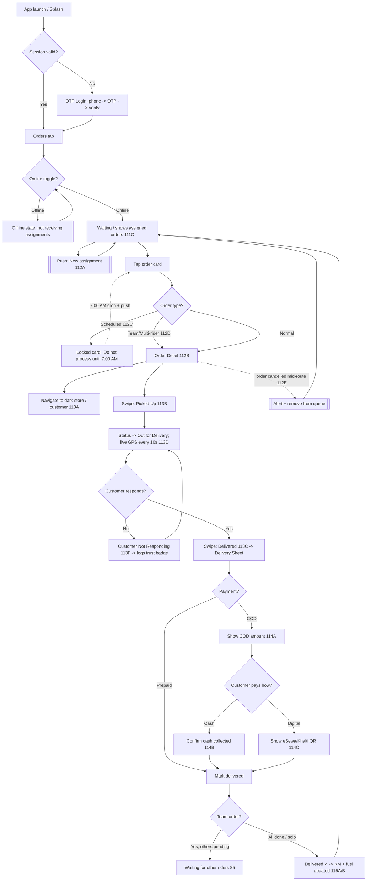

# Chutkima — Rider App User Flow (v1, for approval)

> **Status:** Flow design only. Nothing is implemented yet.
> **Scope source:** Chutkima Scope of Work v5.0 — Section 04 (Rider App, 22 features: 111A–115C) + Section 4.6 Design Rules + Feature 113 (Scheduled) + Feature 114 (Multi-rider).
> **Design system source:** existing `quick_commerce_rider_dashboard.html` (Tailwind + Inter + FontAwesome, card UI, iPhone frame, swipe actions, bottom tab bar) — **visual language reused, rebranded to Chutkima.**

---

## 0. The one thing that changes everything

The existing mockup is a **gig app** (rider browses a feed → *accepts/rejects* jobs → surge heatmap → acceptance-rate score).

**Chutkima is an ASSIGNED-ORDER app.** The admin or packer assigns each order to a specific rider. The rider does **not** choose jobs.

| Removed from mockup (does NOT apply to Chutkima) | Why |
|---|---|
| Job feed / "Nearby Available Jobs" | Orders are pushed by admin, not browsed |
| Swipe-to-Accept / Reject buttons | No accept/reject — rider gets assigned |
| Hotspots / Heatmap / Surge bonus tab | No surge model in scope |
| Acceptance rate / SLA "Gold level" scoring | Not in scope |
| Per-trip payout / weekly incentive | Rider economics = **KM × NPR 4 fuel** only (115A/B) |

| Kept & rebranded | Notes |
|---|---|
| iPhone frame, status bar, home indicator | Visual shell |
| Brand teal | `#0d8368` → **Chutkima teal `#009e99`** (Scope feature 5) |
| Currency `৳` | → **NPR / ₨** |
| Online/Offline toggle | Feature **111B** |
| Order cards, order-detail panel, timeline, item checklist | Reused for assigned orders |
| Swipe action handle | Reused for "Picked Up" / "Delivered" |
| Bottom tab bar | Re-tabbed: Orders · Earnings · History · Profile |
| Live map canvas, call button, COD notice, OTP block, toast | Reused |
| Font | Add **Hind** (Devanagari) for Nepali; Inter for Latin |

---

## 1. Information architecture (Design Rule: max 2 levels deep)

```
[Splash] → [OTP Login] ─────────────► APP SHELL
                                          │
        ┌──────────────┬──────────────┬──┴───────────┐
   TAB 1: ORDERS   TAB 2: EARNINGS  TAB 3: HISTORY  TAB 4: PROFILE   ← Level 1 (bottom nav)
        │
        ├─ Online/Offline toggle (header)
        ├─ Assigned order cards (111C) — badges: SCHEDULED / TEAM
        │
        └─► ORDER DETAIL  ← Level 2 (the only deeper screen)
               ├─ Navigate (113A, opens Google Maps – external)
               ├─ Call customer (113E, opens dialer – external)
               ├─ Swipe: Picked Up (113B)
               ├─ Customer Not Responding (113F)  ─► overlay
               └─ Swipe: Delivered (113C) ─► DELIVERY SHEET (overlay, not a new level)
                        ├─ COD amount (114A) + Cash collected (114B)
                        └─ QR-on-delivery (114C, overlay)
```

Overlays (bottom sheets / modals) are used for delivery confirmation, QR, "not responding", and logout — so the **2-levels-deep** rule (4.6) is never broken.

---

## 2. End-to-end flow (happy path + branches)



---

## 3. Screen-by-screen specification

### S0 · Splash
- Chutkima logo on teal. Checks persisted session → routes to Login or Orders.

### S1 · OTP Login — **111A**
- **Step 1:** phone number field (+977, 10-digit). Big 56px CTA "Send OTP".
- **Step 2:** 6-box OTP input (Sparrow SMS). 5-min expiry, resend after countdown.
- On success → role auto-set to **Rider** → Orders tab. Session persists (no repeat login).
- Errors: invalid OTP, expired, too many attempts (mirror customer OTP rules).

### S2 · ORDERS tab (Home / Level 1) — **111B, 111C, 112A, 112C, 112D, 112E**
- **Header:** rider avatar, name, zone, **Online/Offline toggle (111B)**.
- **Mini stats strip:** Today — Deliveries done · KM today · Cash in hand (read-only mirror of Earnings).
- **State A — Offline:** illustration + "You are offline. Go online to receive assigned orders." No cards shown.
- **State B — Online, empty:** "Waiting for new orders…" pulse indicator.
- **State C — Online, with orders (111C):** vertical list of **Assigned Order Cards**:
  - Order # (e.g. `#BW-2025-0042`), customer area/zone, item count, payment chip (**COD** orange / **Prepaid** blue), COD amount if any.
  - **SCHEDULED badge (112C)** → card greyed/locked: "SCHEDULED — Do not process until 7:00 AM". Not tappable into active flow until activated.
  - **TEAM ORDER badge (112D)** → purple chip + this rider's portion note preview.
  - Tap → S3 Order Detail.
- **112A:** push notification (sound + vibration) for new assignment opens this tab / the order.
- **112E:** if an in-progress order is cancelled, a red alert banner + push appears and the card is removed.

### S3 · ORDER DETAIL (Level 2) — **112B, 113A, 113B, 113C, 113E, 113F, 114A**
- **Back to Orders.** Order # + status pill.
- **Customer block:** name, full address, landmark, building/apt, zone. **Call (113E)** one-tap → dialer. **Navigate (113A)** → Google Maps with address pre-loaded.
- **Items list (112B):** SKU, description, qty (+ optional checklist tick like mockup for self-verification).
- **Payment block:** method; **if COD → big COD amount (114A)** "Collect ₨ X".
- **Team note (112D):** "Your portion: beverages" when multi-rider.
- **Delivery instruction** (e.g. "call from gate") if present.
- **Primary actions (swipe handles, 56px):**
  1. Swipe **Picked Up (113B)** — enabled when packing complete / at store; sets *Out for Delivery*, starts **live GPS every 10s (113D)**.
  2. **Customer Not Responding (113F)** — secondary button, appears after arrival; confirms "Did you call first?" → logs against trust badge.
  3. Swipe **Delivered (113C)** — opens Delivery Sheet (S4).
- **Scheduled order:** detail shown read-only with countdown to 7:00 AM; actions disabled.

### S4 · DELIVERY SHEET (overlay) — **113C, 114A, 114B, 114C**
- **Prepaid:** "Confirm delivery" → done.
- **COD (114A):** "Collect ₨ X" prominent.
  - **Customer pays cash → Confirm Cash Collected (114B)** → adds to daily reconciliation.
  - **Customer pays digital → Show QR (114C):** full-screen eSewa/Khalti QR for customer to scan, then confirm.
- (Optional) delivery OTP/photo — *see Open Questions.*
- On confirm → if **team order & others pending → "Waiting for other riders" (85)**; else order = **Delivered**, KM + fuel update.

### S5 · EARNINGS tab (Level 1) — **114D, 115A, 115B**
- **Today card (teal):** **KM driven today (115A)** · **Fuel = KM × NPR 4 (115B, rate configurable)**.
- **Daily COD summary (114D):** total cash collected vs orders assigned; reconciliation status.
- (No commission/incentive/surge — not in Chutkima scope.)

### S6 · HISTORY tab (Level 1) — **115C**
- List of completed deliveries: order #, time, area, per-delivery KM, fuel earned, payment type. Filter by date.

### S7 · PROFILE tab (Level 1) — Design Rules 4.6
- Name, phone, vehicle, plate, current status. Offline-cache indicator.
- **Logout with confirmation** (Design Rule) → modal "Are you sure? You have an active delivery." guard.

---

## 4. Critical sub-flows (edge cases)

| # | Flow | Behaviour |
|---|---|---|
| 4.1 | **Scheduled order (112C / Feature 113)** | Card locked + badge. Never enters active queue before hours. 7:00 AM cron moves it to active → rider gets push like a normal new order. |
| 4.2 | **Team / multi-rider (112D / Feature 114)** | Team badge + portion note. This rider completes only their portion. Order marked Delivered **only when all assigned riders confirm (85)**; otherwise "Waiting for other riders". |
| 4.3 | **Customer not responding (113F)** | Button after arrival → "Did you call the customer?" confirm → logs an event against the customer's **Trust Badge** system (3.8). |
| 4.4 | **Order cancelled mid-route (112E)** | Push + red in-app alert; order removed from active list; if COD already noted, reconciliation adjusted. |
| 4.5 | **COD digital fallback (114C)** | At door, customer can scan eSewa/Khalti QR instead of cash → confirm. |
| 4.6 | **Offline / no internet (Design Rule)** | Last assigned order's basic info cached & viewable offline; GPS pings queue & resend on reconnect. |
| 4.7 | **Logout guard (Design Rule)** | Confirmation modal; blocked/warned during active delivery. |
| 4.8 | **Go offline with active order** | Toggle disabled or warns until current delivery finished. |

---

## 5. Feature coverage matrix (all 22 rider features)

| Feature | Where it lives |
|---|---|
| 111A OTP Login | S1 |
| 111B Online/Offline toggle | S2 header |
| 111C Current assigned orders | S2 list |
| 112A Push new assignment | System → S2 |
| 112B Full order detail | S3 |
| 112C SCHEDULED badge | S2 card / S3 locked |
| 112D TEAM ORDER badge | S2 card / S3 note |
| 112E Alert on cancellation | S2 banner + push |
| 113A Navigate to customer | S3 (external Maps) |
| 113B Status Picked Up | S3 swipe |
| 113C Status Delivered | S3 swipe → S4 |
| 113D Live GPS every 10s | Background after 113B |
| 113E Call customer | S3 (external dialer) |
| 113F Customer not responding | S3 → overlay → trust log |
| 114A COD amount display | S3 + S4 |
| 114B Cash collected confirm | S4 |
| 114C QR-on-delivery | S4 overlay |
| 114D Daily COD summary | S5 |
| 115A Daily KM tracker | S5 |
| 115B Fuel amount (KM×NPR4) | S5 |
| 115C Delivery history | S6 |
| 4.6 Design rules | Global |

---

## 6. Design-rule checklist (4.6 — non-negotiable)

- [ ] Every actionable button ≥ **56px** tap target (gloves).
- [ ] Body font ≥ **16px** throughout.
- [ ] Navigation ≤ **2 levels** deep (Orders → Order Detail; rest are overlays). ✅ by design above.
- [ ] **Offline cache** of last assigned order.
- [ ] **Logout requires confirmation.**
- [ ] Nepali default (Hind font), English fallback.
- [ ] Brand teal `#009e99`, currency NPR/₨.

---

## 7. Confirm before I implement (decisions)

1. **Delivery proof:** Scope says Delivered "triggers customer confirmation" (113C) but does **not** specify a rider-entered OTP or delivery photo. The mockup had a 4-digit OTP. → **Keep OTP/photo, or just a confirm tap?** (Default I'll use: simple confirm tap, no OTP, unless you want it.)
2. **"Arrived" status:** Customer timeline has 6 steps incl. *Arrived* (27), but rider features only list Picked Up + Delivered. → **Auto-detect "Arrived" by GPS geofence, or add a manual "Arrived" tap?** (Default: auto by GPS.)
3. **Earnings meaning:** Confirm rider sees only **KM + fuel + COD** (no commission/salary in app). (Default: yes, per scope.)
4. **Tabs:** Confirm 4 tabs = **Orders · Earnings · History · Profile** (dropping Hotspots/Heatmap). (Default: yes.)
5. **Output format when you say "implement":** single self-contained HTML prototype (like the existing file, iPhone frame, clickable) **or** start the real Flutter screens? (Default: HTML clickable prototype first, matching the design system.)

---

*When you're happy with this flow, say the word and I'll implement it following the existing design system.*
